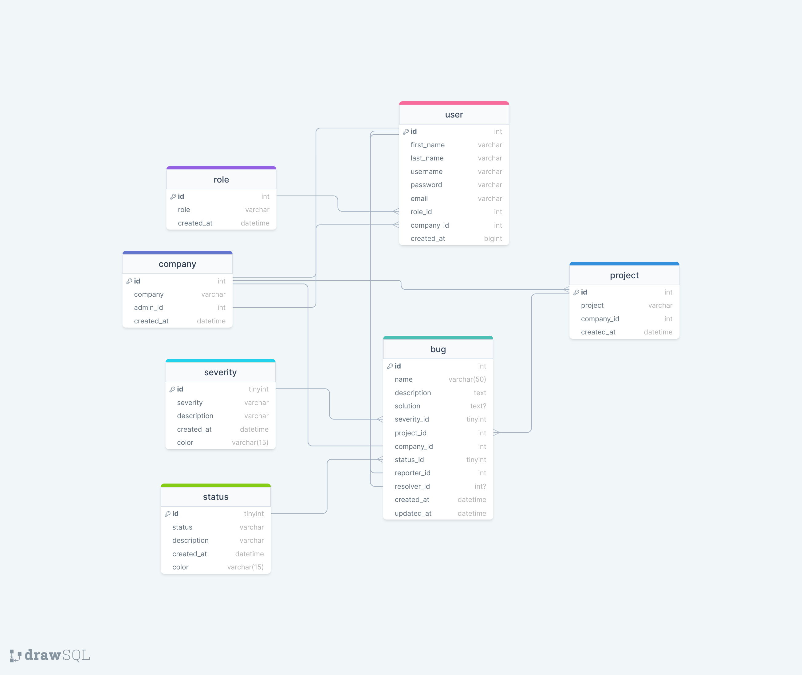

# RE-BUG Project (Back-End)

A bug tracker project that is built on Next.js and Python (Flask).

RE-BUG allowes users to register with a role from one of the following: tester, developer, project manager and admin.

After authenticating, a user can see the history of a bugs related to a specific project.

They can modify bugs, add severity levels, see analytics, etc.


## Table of contents
* [Tecth Stack](#tech-stack)
* [Features](#features)
* [Used Packages](#used-packages)
* [Project Structure](#project-structure)
* [Database Model](#database-model)

## Tech Stack
**Client:** React, Next.js, TailwindCSS, HTML & CSS, TypeScript, JavaScript

**Server:** Python, Flask, MySQL


## Features
- Registration Form
- Authorization Form
- Field Validations
- Pie Chart Analytics For Each Project
- Ability to Add Projects to A Company
- Bugs CRUD
- Personal Information Section
- See The Status of Each Bug
- See The Severity of Each Bug
- Status And Severity Descriptions
- Caching Data
- SSR (Server-side Rendering)
- Security Validations
## Used Packages
- [Flask](https://flask.palletsprojects.com/en/3.0.x/) - Python Framework
- [Flask-RESTful](https://flask-restful.readthedocs.io/en/latest/) - For making REST API
- [Flask-SQLAlchemy](https://flask-sqlalchemy.palletsprojects.com/en/3.1.x/) - For using Flask ORM
- [SQLAlchemy](https://www.sqlalchemy.org/) - For using Flask ORM
- [flask_bcrypt](https://pypi.org/project/Flask-Bcrypt/) - For hashing passwords
- [Flask-Migrate](https://flask-migrate.readthedocs.io/en/latest/) - For migrating databases
- [python-dotenv](https://pypi.org/project/python-dotenv/) - For loading .env
- [MySQL-python](https://pypi.org/project/MySQL-python/) - For creating MySQL database
- [Flask-WTF](https://flask-wtf.readthedocs.io/en/1.2.x/) - For validating forms
- [flask-jwt-extended](https://flask-jwt-extended.readthedocs.io/en/stable/) - For creating Json Web Tokens
- [flask-cors](https://flask-cors.readthedocs.io/) - For configuring CORS
- [click](https://click.palletsprojects.com/en/8.1.x/) - For creating commands
- [email_validator](https://pypi.org/project/email-validator/) - For validating email
- [Flask-Seeder](https://pypi.org/project/Flask-Seeder/) - For seeding base data into database

## Project Structure
```bash
+---app
|   |   __init__.py
|   |   
|   +---api
|   |   |   __init__.py
|   |   |   
|   |   +---routes
|   |   |   |   example_routes.py
|   |   |   |   __init__.py
|   |   |   |             
|   +---models
|   |   |   Model.py
|   |   |   __init__.py
|   |           
|   +---validations
|   |   |   something_validation.py
|   |   |   __init__.py            
|           
+---migrations
|   |   alembic.ini
|   |   env.py
|   |   README
|   |   script.py.mako
|   |   
|   +---versions
|   |   |   079ac37a448e_create_something_table.py            
|           
+---seeds
|   |   seed_something.py
|   |   __init__.py       
|
|   .env
|   .gitignore
|   config.py
|   main.py
|   output.txt
|   requirements.txt
```

## Database Model
[Click here to see the diagram](https://drawsql.app/teams/haru-1/diagrams/re-bug)

        